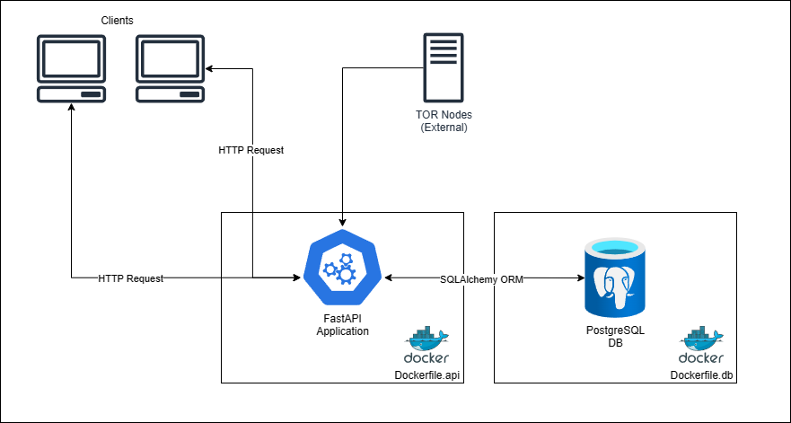
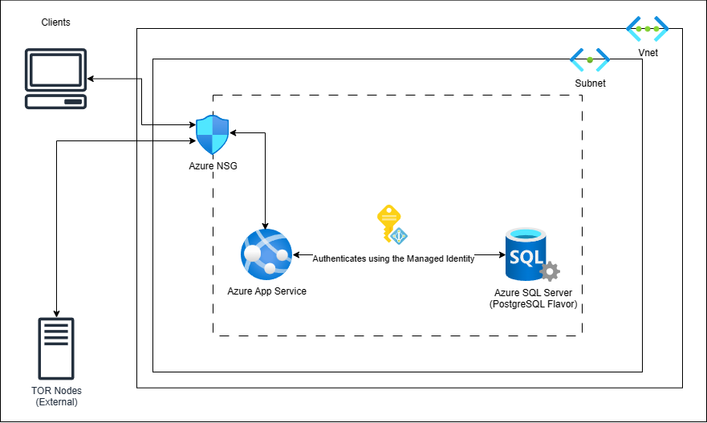

# meli-challenge

## Table of Contents

- [Synopsis](#synopsis)
- [Proposed Stack](#proposed-stack)
- [Requirements](#requirements)
- [Getting Started](#getting-started)
- [API Endpoints and Permission Model](#api-endpoints-and-permission-model)
- [Cloud Native Solution](#cloud-native-solution)

---

### Synopsis:

**MercadoLibre** needs an application to filter TOR Exit Routes. The application needs to be managed through the usage of API Endpoints. The application needs to be able to:

- List IP Addresses from External Sources that will serve as TOR Exit Routes.
- Add IP Addresses Exemptions.
- List the TOR Exit Routes without the exemptions.

---

### Proposed Stack
- **[FastAPI](https://fastapi.tiangolo.com/)** for the API Endpoint framework.  
- **[PostgreSQL](https://www.postgresql.org/)** for the database.
- **[SqlAlchemy](https://www.sqlalchemy.org/)** for ORM.
- **[Docker](https://docs.docker.com/)** for containerization.
- **[Docker Compose](https://docs.docker.com/compose/)** for building and running the multi-container solution.



---

### Requirements:
* Docker and Docker Compose

---

### Getting Started:

1. Clone the repository:

```
git clone https://github.com/agustin-blasco/meli-challenge.git
```

2. Navigate to the project directory:

```
cd meli-challenge
```

3. Build and start the Docker containers:

```
docker compose up -d --build
```

4. Navigate to the API Documentation

```
http://127.0.0.1:8001/docs
```

---

### API Endpoints and Permission Model:

| API Endpoint                                  | Description                                                                                         | HTTP Method | Authorized Roles                 |
| --------------------------------------------- | --------------------------------------------------------------------------------------------------- | ----------- | -------------------------------- |
| /admin/new-superadmin                         | Creates an account called `SuperAdmin` which has Admin access.                                      | `POST`      | No permission required. *        |
| /authentication/token                         | Authenticate and get a Bearer Token.                                                                | `POST`      | `Admin`, `Contributor`, `Reader` |
| /admin/users                                  | Get all the Users.                                                                                  | `GET`       | `Admin`, `Contributor`, `Reader` |
| /admin/users                                  | Creates a new User.                                                                                 | `POST`      | `Admin`                          |
| /admin/users/{user_id}                        | Updates an existing User.                                                                           | `PUT`       | `Admin`, `Contributor`, `Reader` |
| /admin/users/{user_id}                        | Deletes a User.                                                                                     | `DELETE`    | `Admin`                          |
| /tor-nodes/external-all                       | Get All TOR Exit Nodes.                                                                             | `GET`       | `Admin`, `Contributor`, `Reader` |
| /tor-nodes/exemptions                         | Get All IP Exemptions from TOR Exit Nodes.                                                          | `GET`       | `Admin`, `Contributor`, `Reader` |
| /tor-nodes/exemptions                         | Create a new IP Exemption.                                                                          | `POST`      | `Admin`, `Contributor`           |
| /tor-nodes/exemptions{ip_address_id}          | Deletes a new IP Exemption.                                                                         | `DELETE`    | `Admin`, `Contributor`           |
| /tor-nodes/external-filtered-exemptions       | Get the TOR Exit Nodes from External Sources without the exempted IPs.                              | `GET`       | `Admin`, `Contributor`, `Reader` |
| /logs                                         | Get all the Logs.                                                                                   | `GET`       | `Admin`, `Contributor`           |

***Note: This endpoint can only be ran once and it's only intented for first run of the application. It doesn't require any Authentication or Authorization to be executed.**

---

### Cloud Native Solution:

#### Using Azure Services

- **Azure App Service** to host the **FastAPI** Application.
- **Azure SQL Server** to host the **PostgreSQL** Database.
- **Azure Virtual Networks (VNet)**:
    - **Subnet** to allow communication between the **App Service** and **SQL Server** using **Service Endpoints**.
    - **Vnet Integration** to allow the connectivity between the PaaS services without exposing the traffic to the Internet.
    - **Network Security Group (NSG)** to narrow down and only open the Ports required for the FastAPI application.
- **Managed Identity** that will be binded to the **App Service** and will have permission over the PostgreSQL DB.



#### Using Azure Kubernetes Service (AKS)

- Prerequisites:
    - **[Kompose](https://kompose.io/)**

1. Create or select and existing **Azure Container Registry** (ACR)
2. Create a Tag for the Images and Push them to the ACR

    ```
    docker tag meli-challenge-api <acrName>.azurecr.io/challenge/meli-challenge-api
    docker tag meli-challenge-database <acrName>.azurecr.io/challenge/meli-challenge-database

    docker push <acrName>.azurecr.io/challenge/meli-challenge-api
    docker push <acrName>.azurecr.io/challenge/meli-challenge-database
    ```

3. Create the **AKS** resource in Azure.
4. Convert the `compose.yml` to Kubernetes YAML files using **Kompose**:

    ```
    kompose convert -f compose.yml
    ```

5. Merge the contents of the YAML files generated in **Step 4** into a new YAML file.
6. Deploy the Application:

    ```
    kubectl apply -f <filename>.yaml
    ```